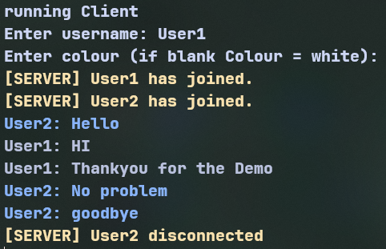

# Realtime chat app

_**Abstract:**_ A real time chat application to help me better understand networking.  
_**Purpose:**_ A terminal application that lets you communicate quickly with others on the same connection.



## Key features

- TCP base
- CLI based tooling
- Custom Logging tool
- client side customisation

## How to use

Firstly: run the command to run the server.

<!-- this runs the daemon process. -->

```shell
./app server
```

you can now view the room via the following command
defaults to client when empty

<!-- _this looks at the stored room ID_ -->

```shell
./app <client>
```

<!--
then when you want to send a message,
you can either send a message in the chatroom ui
or by using the % symbol in your terminal like

```shell
% this is a test message
``` -->

## Credits

This project uses **argparse** by **p-ranav**, licensed under a **MIT** license

## Contact

\> [github](https://github.com/sparrowsaurora)  
\> [email](mailto:sparrows.au@gmail.com)

[(Back To Top)](#Realtime-chat-app)
